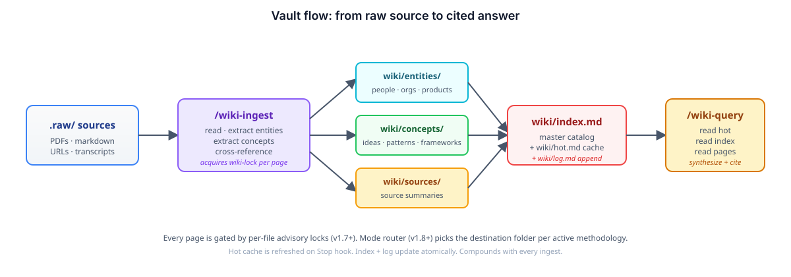
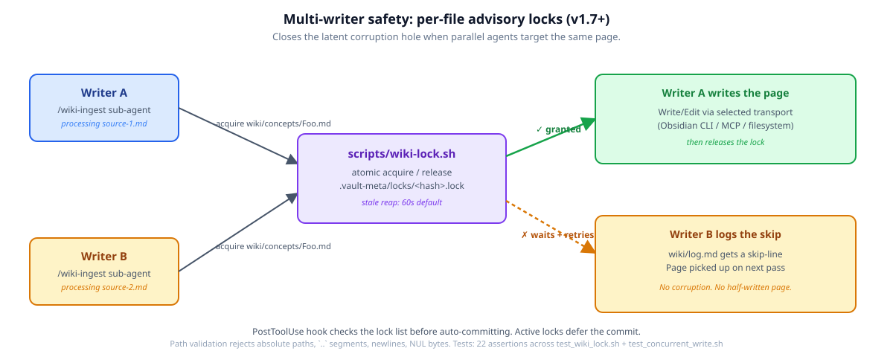
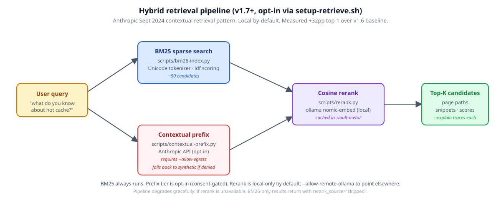

> **Yotam's fork** — sourced via the [himmel](https://github.com/yotamleo/himmel) marketplace; the original is at [AgriciDaniel/claude-obsidian](https://github.com/AgriciDaniel/claude-obsidian). Vendor + attribution only, no upstream PR for now. See [ATTRIBUTION.md](ATTRIBUTION.md) for full credits.

# claude-obsidian: Self-Organizing AI Second Brain for Obsidian + Claude Code

<p align="center">
  
</p>

[](https://github.com/AgriciDaniel/claude-obsidian/stargazers)
[](LICENSE)
[](https://github.com/AgriciDaniel/claude-obsidian/releases/latest)
[](https://github.com/AgriciDaniel/claude-obsidian/actions/workflows/test.yml)
[](https://code.claude.com/docs/en/discover-plugins)
[](https://obsidian.md)
[](https://agentskills.io)
[](https://www.skool.com/ai-marketing-hub-pro)
[](https://agricidaniel.com/blog/claude-obsidian-ai-second-brain)

Claude + Obsidian knowledge companion and self-organizing AI second brain. A running AI notetaker that builds and maintains a persistent, compounding wiki vault. Every source you add gets integrated. Every question you ask pulls from everything that has been read. Knowledge compounds like interest.

Open-source Obsidian AI plugin for AI note-taking, personal knowledge management (PKM), second-brain workflows, and a private Notion alternative. **15 Claude Code skills**, multi-agent support, multi-writer safe (v1.7+), first-class methodology modes (LYT / PARA / Zettelkasten / Generic via v1.8), and the 10-principle thinking framework (v1.9). Based on [Andrej Karpathy's LLM Wiki pattern](https://gist.github.com/karpathy/442a6bf555914893e9891c11519de94f).

> **Two ways to get this skill.** Pick the one that fits how you work.
>
> - 🌐 **Public open-source build** (latest: `v1.9.2`, recommended): the free, MIT-licensed release on [Daniel Agrici's GitHub](https://github.com/AgriciDaniel/claude-obsidian). Open to anyone, no membership required. Ships everything: v1.7 Compound Vault, v1.8 methodology modes, and the v1.9 thinking framework plus audit hardening.
> - ⚡ **AI Marketing Hub Pro**: the same MIT-licensed core, plus earliest access to in-development features before they land here, direct collaboration, and the [Pro community](https://www.skool.com/ai-marketing-hub-pro). Pro members install from the [AI Marketing Hub](https://github.com/AI-Marketing-Hub) org mirror (swap note under Option 2 below).

> ✨ **v1.7 "Compound Vault" refoundation**: Obsidian CLI as default transport, hybrid retrieval (contextual prefix + BM25 + cosine rerank per [Anthropic's Sept 2024 research](https://www.anthropic.com/news/contextual-retrieval)), per-file advisory locking that closes a latent multi-writer corruption hole, and substrate alignment with [kepano/obsidian-skills](https://github.com/kepano/obsidian-skills). Full guide: [docs/compound-vault-guide.md](docs/compound-vault-guide.md). Optional [DragonScale Memory](docs/dragonscale-guide.md) extension (log folds, deterministic page addresses, semantic tiling lint, boundary-first autoresearch).

---

## Contents

- [What It Does](#what-it-does)
- [Why claude-obsidian?](#why-claude-obsidian)
- [Quick Start](#quick-start)
- [Commands](#commands)
  - [`/wiki`: setup, scaffold, continue](#wiki-setup-scaffold-continue)
  - [`/autoresearch`: autonomous research loop](#autoresearch-autonomous-research-loop)
  - [`/canvas`: visual layer](#canvas-visual-layer)
  - [`/think`: 10-principle thinking loop](#think-10-principle-thinking-loop)
- [Methodology Modes (v1.8+)](#methodology-modes-v18)
- [Vault Use Cases (v1.0+)](#vault-use-cases-v10)
- [Cross-Project Knowledge Base](#cross-project-knowledge-base)
- [What Gets Created](#what-gets-created)
- [Architecture](#architecture)
- [MCP Setup (Optional)](#mcp-setup-optional)
- [Plugins](#plugins)
- [CSS Snippets](#css-snippets-auto-enabled-by-setup-vaultsh)
- [Banner Plugin](#banner-plugin)
- [File Structure](#file-structure)
- [AutoResearch Configuration](#autoresearch-programmd)
- [Seed Vault](#seed-vault)
- [Companion: claude-canvas](#companion-claude-canvas)
- [FAQ](#faq)
- [Requirements](#requirements)
- [Uninstall](#uninstall)
- [Contributing](#contributing)
- [Related Projects](#related-projects)
- [Community](#community)
- [License](#license)

---

## What It Does

### [YouTube Demo](https://www.youtube.com/watch?v=a2hgayvr-H4)

<p align="center">
  
</p>

You drop sources. Claude reads them, extracts entities and concepts, updates cross-references, and files everything into a structured Obsidian vault. The wiki gets richer with every ingest.

You ask questions. Claude reads the hot cache (recent context), scans the index, drills into relevant pages, and synthesizes an answer. It cites specific wiki pages, not training data.

You lint. Claude finds orphans, dead links, stale claims, and missing cross-references. Your wiki stays healthy without manual cleanup.

At the end of every session, Claude updates a hot cache. The next session starts with full recent context, no recap needed.

<p align="center">
  
  
</p>

---

## Why claude-obsidian?

Most Obsidian AI plugins are chat interfaces. They answer questions about your existing notes. claude-obsidian is a knowledge engine. It creates, organizes, maintains, and evolves your notes autonomously.

| Capability | claude-obsidian | Smart Connections | Copilot |
|---|---|---|---|
| **Auto-organize notes** | ✅ Creates entities, concepts, cross-references | ❌ | ❌ |
| **Contradiction flagging** | ✅ `[!contradiction]` callouts with sources | ❌ | ❌ |
| **Session memory** | ✅ Hot cache persists between conversations | ❌ | ❌ |
| **Vault maintenance** | ✅ 8-category lint (orphans, dead links, gaps) | ❌ | ❌ |
| **Autonomous research** | ✅ 3-round web research with gap-filling | ❌ | ❌ |
| **Methodology modes** | ✅ LYT / PARA / Zettelkasten / Generic (first-class) | ❌ | ❌ |
| **Thinking framework** | ✅ 10-principle loop as invocable skill | ❌ | ❌ |
| **Multi-model support** | ✅ Claude, Gemini, Codex, Cursor, Windsurf | ❌ Claude only | ✅ Multiple |
| **Visual canvas** | ✅ Via [claude-canvas](https://github.com/AgriciDaniel/claude-canvas) | ❌ | ❌ |
| **Multi-writer safe** | ✅ Per-file advisory locks (v1.7+) | ❌ | ❌ |
| **Query with citations** | ✅ Cites specific wiki pages | ✅ Cites similar notes | ✅ Cites notes |
| **Batch ingestion** | ✅ Parallel agents for multiple sources | ❌ | ❌ |
| **Open source** | ✅ MIT | ✅ MIT | ⚠️ Freemium |

> 📖 **Deep dive:** [I Turned Obsidian Into a Self-Organizing AI Brain](https://agricidaniel.com/blog/claude-obsidian-ai-second-brain). Full breakdown with data visualizations, market context, and workflow demos.

---

## Quick Start

> ℹ️ The commands below install the **public open-source build** from `AgriciDaniel/claude-obsidian` (recommended, no membership needed). **AI Marketing Hub Pro members** who want early access to in-development features can swap `AgriciDaniel/claude-obsidian` for `AI-Marketing-Hub/claude-obsidian` (Option 2 also swaps the plugin slug; see the note under that option).

### Option 1: Clone as vault (recommended, full setup in 2 minutes)

```bash
git clone https://github.com/AgriciDaniel/claude-obsidian
cd claude-obsidian
bash bin/setup-vault.sh
```

Open the folder in Obsidian: **Manage Vaults → Open folder as vault → select `claude-obsidian/`**.

Open Claude Code in the same folder. Type `/wiki`.

> ℹ️ `setup-vault.sh` configures `graph.json` (filter + colors), `app.json` (excludes plugin dirs), and `appearance.json` (enables CSS). Run it once before the first Obsidian open. You get the fully pre-configured graph view, color scheme, and wiki structure out of the box.

---

### Option 2: Install as Claude Code plugin

Plugin installation is a two-step process. First add the marketplace catalog, then install the plugin from it.

> ℹ️ **Which version are you installing?**
>
> - **Public (recommended, no membership):** the commands below install the free, MIT-licensed release from [`AgriciDaniel/claude-obsidian`](https://github.com/AgriciDaniel/claude-obsidian). Nothing to sign up for.
> - **AI Marketing Hub Pro member?** For early access to in-development features, swap `AgriciDaniel/claude-obsidian` for `AI-Marketing-Hub/claude-obsidian` and the plugin slug `claude-obsidian@agricidaniel-claude-obsidian` for `claude-obsidian@ai-marketing-hub-claude-obsidian`. The org mirror requires an authenticated `gh auth login` (or GitHub PAT) with access to the `AI-Marketing-Hub` org. If `/plugin marketplace add` returns a 404, your account is not in the org yet. DM in the [Skool community](https://www.skool.com/ai-marketing-hub-pro) to get added.

```bash
# Step 1: add the marketplace
claude plugin marketplace add AgriciDaniel/claude-obsidian

# Step 2: install the plugin
claude plugin install claude-obsidian@agricidaniel-claude-obsidian
```

In any Claude Code session: `/wiki`. Claude walks you through vault setup.

To check it worked:

```bash
claude plugin list
```

---

### Option 3: Add to an existing vault

Copy `WIKI.md` into your vault root. Paste into Claude:

```
Read WIKI.md in this project. Then:
1. Check if Obsidian is installed. If not, install it.
2. Check if the Local REST API plugin is running on port 27124.
3. Configure the MCP server.
4. Ask me ONE question: "What is this vault for?"
Then scaffold the full wiki structure.
```

---

## Commands

| You say | Claude does |
|---------|------------|
| `/wiki` | Setup check, scaffold, or continue where you left off |
| `ingest [file]` | Read source, create 8-15 wiki pages, update index and log |
| `ingest all of these` | Batch process multiple sources, then cross-reference |
| `what do you know about X?` | Read index, drill into relevant pages, synthesize answer |
| `/save` | File the current conversation as a wiki note |
| `/save [name]` | Save with a specific title (skips the naming question) |
| `/autoresearch [topic]` | Run the autonomous research loop: search, fetch, synthesize, file |
| `/canvas` | Open or create the visual canvas, list zones and nodes |
| `/canvas add image [path]` | Add an image (URL or local path) to the canvas with auto-layout |
| `/canvas add text [content]` | Add a markdown text card to the canvas |
| `/canvas add pdf [path]` | Add a PDF document as a rendered preview node |
| `/canvas add note [page]` | Pin a wiki page as a linked card on the canvas |
| `/canvas zone [name]` | Add a new labeled zone to organize visual content |
| `/canvas from banana` | Capture recently generated images onto the canvas |
| `/think [problem]` | Apply the 10-principle thinking loop to a non-trivial problem |
| `lint the wiki` | Health check: orphans, dead links, gaps, suggestions |
| `update hot cache` | Refresh hot.md with latest context summary |

> ✨ **Want more?** [claude-canvas](https://github.com/AgriciDaniel/claude-canvas) adds 12 templates, 6 layout algorithms, AI image generation, presentations, and full canvas orchestration. Install both, they complement each other.

### `/wiki`: setup, scaffold, continue

First-run setup walks through:

1. Check Obsidian is installed
2. Check Local REST API plugin (if MCP transport desired)
3. Ask "What is this vault for?" (one question, drives the scaffold)
4. Scaffold per chosen [Methodology Mode](#methodology-modes-v18) and [Vault Use Case](#vault-use-cases-v10)
5. Seed `hot.md`, `index.md`, `log.md`, `wiki/meta/dashboard.base`
6. Suggest the first ingest

On subsequent runs, `/wiki` continues where you left off. It checks vault health, surfaces stale claims, and shows recent activity from `hot.md`.

### `/autoresearch`: autonomous research loop

Configurable program at [`skills/autoresearch/references/program.md`](skills/autoresearch/references/program.md):

- Max rounds (default 3)
- Max pages per session (default 15)
- Source preference rules (academic, official docs, news)
- Confidence scoring + domain constraints

The loop:

1. **Round 1, broad search**: decompose into 3-5 angles, run 2-3 queries per angle, fetch top 2-3 results per angle
2. **Round 2, gap fill**: targeted searches for contradictions and missing pieces
3. **Round 3, synthesis check** (optional): one more pass if major gaps remain
4. **Filing**: synthesis page + source pages + entity pages + concept pages, all cross-referenced

URL validation + content sanitization applied per the `## Web egress hygiene (v1.8.2+)` policy in [`skills/autoresearch/SKILL.md`](skills/autoresearch/SKILL.md): rejects `file://` / `javascript:` / RFC1918 hosts, strips `<script>` and wikilink-injection attempts, caps fetch bodies at 50KB.

### `/canvas`: visual layer

Add images, PDFs, notes, and AI-generated images to an Obsidian canvas. Zone management for grouping. Auto-layout positions nodes without overlap.

```
/canvas                       # open or create the canvas
/canvas add image <path>      # add an image with auto-layout
/canvas add pdf <path>        # render PDF as preview node
/canvas add note <wiki-page>  # pin a wiki page as a linked card
/canvas zone <name>           # add a labeled zone
/canvas from banana           # capture recent banana-generated images
```

JSON Canvas 1.0 spec compliant ([`skills/canvas/references/canvas-spec.md`](skills/canvas/references/canvas-spec.md)). Full orchestration (12 templates, 6 layout algorithms, presentations) in the companion [claude-canvas](https://github.com/AgriciDaniel/claude-canvas).

### `/think`: 10-principle thinking loop

Apply the OBSERVE-OBSERVE-LISTEN-THINK-CONNECT-CONNECT-FEEL-ACCEPT-CREATE-GROW framework to any non-trivial problem (architectural decisions, audits, post-mortems, ambiguous user requests).

```
/think <problem statement>
```

The framework walks Claude through 10 stages with prompts at each. Use when problem novelty + irreversibility justify the discipline. See [`skills/think/SKILL.md`](skills/think/SKILL.md) for the full framework. Every other skill has a "How to think" appendix mapping the framework to its specific work. The [v1.8.0 pre-push audit](docs/audits/v1.8.0-pre-push-audit-2026-05-18.md) used this framework as its methodology spine.

---

## Methodology Modes (v1.8+)

Four organizational philosophies, opt-in via `bash bin/setup-mode.sh`. The `wiki-mode` skill (v1.8+) reads `.vault-meta/mode.json` and routes new pages accordingly. Default is `generic` (v1.7 behavior, no opinion imposed).

| Mode | Philosophy | Filing convention |
|------|-----------|-------------------|
| **Generic** (default) | No opinion. v1.7 behavior preserved. | `wiki/sources/`, `wiki/entities/`, `wiki/concepts/`, `wiki/sessions/` |
| **LYT** (Linking Your Thinking) | Notes link, folders don't. MOCs are the navigation primitive. | `wiki/mocs/<topic>-moc.md` + `wiki/notes/<atomic-note>.md` |
| **PARA** (Tiago Forte) | Organize by actionability (Projects, Areas, Resources, Archives). | `wiki/projects/`, `wiki/areas/`, `wiki/resources/`, `wiki/archives/` |
| **Zettelkasten** (Luhmann slip-box) | Atomic notes, unique IDs, dense bidirectional linking, no folders. | `wiki/<YYYYMMDDHHMMSSffffff>-<slug>.md` (flat, timestamped) |

Switching modes does NOT auto-migrate existing files. Full guide: [`docs/methodology-modes-guide.md`](docs/methodology-modes-guide.md).

---

## Vault Use Cases (v1.0+)

These describe **what** your vault is for. They compose with Methodology Modes (which describe **how** it is organized).

| Use case | When to use |
|----------|-------------|
| **A: Website** | Sitemap, content audit, SEO wiki |
| **B: GitHub** | Codebase map, architecture wiki |
| **C: Business** | Project wiki, competitive intelligence |
| **D: Personal** | Second brain, goals, journal synthesis |
| **E: Research** | Papers, concepts, thesis |
| **F: Book/Course** | Chapter tracker, course notes |

Use cases can be combined. A Business + Research vault organized in PARA is a valid composition.

---

## Cross-Project Knowledge Base

Point any Claude Code project at this vault. Add to that project's `CLAUDE.md`:

```markdown
## Wiki Knowledge Base
Path: ~/path/to/vault

When you need context not already in this project:
1. Read wiki/hot.md first (recent context cache)
2. If not enough, read wiki/index.md
3. If you need domain details, read the relevant domain sub-index
4. Only then drill into specific wiki pages

Do NOT read the wiki for general coding questions or tasks unrelated to [domain].
```

Your executive assistant, coding projects, and content workflows all draw from the same knowledge base.

---

## What Gets Created

A typical scaffold creates:

- Folder structure for your chosen use case + methodology mode
- `wiki/index.md`: master catalog
- `wiki/log.md`: append-only operation log
- `wiki/hot.md`: recent context cache
- `wiki/overview.md`: executive summary
- `wiki/meta/dashboard.base`: Bases dashboard (primary, native Obsidian)
- `wiki/meta/dashboard.md`: Legacy Dataview dashboard (optional fallback)
- `_templates/`: Obsidian Templater templates for each note type
- `.obsidian/snippets/vault-colors.css`: color-coded file explorer
- Vault `CLAUDE.md`: auto-loaded project instructions

---

## Architecture

Three diagrams explain the substantive design choices of the plugin.

### Vault flow

Sources land in `.raw/`. The `/wiki-ingest` agent reads each source, extracts entities and concepts, files them into the appropriate `wiki/` subfolder (per active methodology mode), and updates the index, log, and hot cache. Queries read hot → index → pages in that order to keep token cost low.

<p align="center">
  
</p>

### Multi-writer safety (v1.7+)

Parallel ingest sub-agents can target the same wiki page if the user batches multiple sources. `scripts/wiki-lock.sh` provides per-file advisory locks: one writer acquires, the other waits and retries on the next pass. The PostToolUse auto-commit hook checks the lock list before staging, deferring the commit while writes are in flight.

<p align="center">
  
</p>

### Hybrid retrieval (v1.7+, opt-in)

The `/wiki-retrieve` skill ships a three-tier retrieval pipeline based on [Anthropic's Sept 2024 contextual retrieval research](https://www.anthropic.com/news/contextual-retrieval). BM25 is the always-on sparse layer. The contextual-prefix tier is consent-gated (`--allow-egress`) for users who want to send page bodies to the Anthropic API for prefix generation. Cosine rerank uses a local ollama model by default. The 50-query benchmark in v1.7 measured +32 percentage points top-1 accuracy and +41 percent error reduction vs the v1.6 baseline.

<p align="center">
  
</p>

> ℹ️ Provision the pipeline with `bash bin/setup-retrieve.sh`. It builds the BM25 index, prompts for egress consent, and validates the ollama connection. The pipeline degrades gracefully: if any tier is unavailable, the rest still return useful results.

---

## MCP Setup (Optional)

MCP lets Claude read and write vault notes directly without copy-paste.

**Option A (REST API based):**

1. Install the Local REST API plugin in Obsidian
2. Copy your API key
3. Run:

```bash
claude mcp add-json obsidian-vault '{
  "type": "stdio",
  "command": "uvx",
  "args": ["mcp-obsidian"],
  "env": {
    "OBSIDIAN_API_KEY": "your-key",
    "OBSIDIAN_HOST": "127.0.0.1",
    "OBSIDIAN_PORT": "27124",
    "NODE_TLS_REJECT_UNAUTHORIZED": "0"
  }
}' --scope user
```

**Option B (filesystem based, no plugin needed):**

```bash
claude mcp add-json obsidian-vault '{
  "type": "stdio",
  "command": "npx",
  "args": ["-y", "@bitbonsai/mcpvault@latest", "/path/to/your/vault"]
}' --scope user
```

> ℹ️ Both transports are auto-detected by `scripts/detect-transport.sh`. The result lands in `.vault-meta/transport.json`. To pin a manual choice, edit that file and set `"manual_override": true` (v1.8.2+ honors it).

---

## Plugins

### Core Plugins (built into Obsidian, no install needed)

| Plugin | Purpose |
|--------|---------|
| **Bases** | Powers `wiki/meta/dashboard.base`: native database views. Available since Obsidian v1.9.10 (August 2025). Replaces Dataview for the primary dashboard. |
| **Properties** | Visual frontmatter editor |
| **Backlinks**, **Outline**, **Graph view** | Standard navigation |

### Pre-installed Community Plugins (ship with this vault)

Enable in **Settings → Community Plugins → enable**:

| Plugin | Purpose | Notes |
|--------|---------|-------|
| **Calendar** | Right-sidebar calendar with word count + task dots | Pre-installed |
| **Thino** | Quick memo capture panel | Pre-installed |
| **Excalidraw** | Freehand drawing canvas, annotate images | Pre-installed* |
| **Banners** | Notion-style header image via `banner:` frontmatter | Pre-installed |

\* Excalidraw `main.js` (8MB) is downloaded automatically by `setup-vault.sh`. It is not tracked in git.

### Also install from Community Plugins (not pre-installed)

| Plugin | Purpose |
|--------|---------|
| **Templater** | Auto-fills frontmatter from `_templates/` |
| **Obsidian Git** | Auto-commits vault every 15 minutes |
| **Dataview** *(optional, legacy)* | Only needed for the legacy `wiki/meta/dashboard.md` queries. The primary dashboard now uses Bases. |

Also install the **[Obsidian Web Clipper](https://obsidian.md/clipper)** browser extension. Sends web pages to `.raw/` in one click.

---

## CSS Snippets (auto-enabled by setup-vault.sh)

Three snippets ship with the vault and are enabled automatically:

| Snippet | Effect |
|---------|--------|
| `vault-colors` | Color-codes `wiki/` folders by type in the file explorer (blue = concepts, green = sources, purple = entities) |
| `ITS-Dataview-Cards` | Turns Dataview `TABLE` queries into visual card grids: use ` ```dataviewjs ` with `.cards` class |
| `ITS-Image-Adjustments` | Fine-grained image sizing in notes: append `\|100` to any image embed |

---

## Banner Plugin

Add to any wiki page frontmatter:

```yaml
banner: "_attachments/images/your-image.png"
banner_icon: "🧠"
```

The page renders a full-width header image in Obsidian. Works great for hub pages and overviews.

---

## File Structure

```
claude-obsidian/
├── .claude-plugin/
│   ├── plugin.json              # manifest
│   └── marketplace.json         # distribution
├── skills/                       # 15 Claude Code skills (v1.9.2)
│   ├── wiki/                    # orchestrator + references
│   ├── wiki-ingest/             # source ingestion
│   ├── wiki-query/              # answer questions from the vault
│   ├── wiki-lint/               # vault health check
│   ├── wiki-cli/                # Obsidian CLI transport (v1.7+)
│   ├── wiki-retrieve/           # hybrid retrieval (v1.7+, opt-in)
│   ├── wiki-mode/               # methodology modes router (v1.8+)
│   ├── wiki-fold/               # log rollup (DragonScale opt-in)
│   ├── save/                    # /save: file conversations to wiki
│   ├── autoresearch/            # autonomous research loop
│   ├── canvas/                  # visual layer (images, PDFs, notes)
│   ├── defuddle/                # web extraction wrapper
│   ├── obsidian-bases/          # Bases schema reference
│   ├── obsidian-markdown/       # OFM syntax reference
│   └── think/                   # 10-principle thinking framework (v1.9+)
├── agents/
│   ├── verifier.md              # pre-commit audit agent (v1.7.1+)
│   ├── wiki-ingest.md           # parallel batch ingestion agent
│   └── wiki-lint.md             # health check agent
├── commands/                     # slash command entry points
├── hooks/
│   └── hooks.json               # SessionStart + Stop + PostToolUse hooks
├── scripts/                      # 12 helper scripts (transport, locking, retrieval, etc.)
├── tests/                        # 9 hermetic test suites (~1240 assertions, make test)
├── bin/                          # 5 setup scripts (setup-vault, setup-retrieve, setup-mode, etc.)
├── _templates/                   # Obsidian Templater templates
├── wiki/                         # seeded vault content (demo)
│   ├── canvases/                # welcome.canvas + main.canvas
│   ├── concepts/                # seeded: LLM Wiki Pattern, Hot Cache, Compounding Knowledge
│   ├── entities/                # seeded: Andrej Karpathy
│   ├── sources/                 # populated by your first ingest
│   └── meta/
│       ├── dashboard.base       # Bases dashboard (primary)
│       └── dashboard.md         # Legacy Dataview dashboard (optional)
├── docs/                         # guides + audits + release notes
├── .raw/                         # source documents (hidden in Obsidian)
├── .obsidian/snippets/           # vault-colors.css (3-color scheme)
├── WIKI.md                       # full schema reference
├── CLAUDE.md                     # project instructions
└── README.md                     # this file
```

---

## AutoResearch: program.md

The `/autoresearch` command is configurable. Edit [`skills/autoresearch/references/program.md`](skills/autoresearch/references/program.md) to control:

- What sources to prefer (academic, official docs, news)
- Confidence scoring rules
- Max rounds and max pages per session
- Domain-specific constraints

The default program works for general research. Override it for your domain. A medical researcher would add "prefer PubMed". A business analyst would add "focus on market data and filings".

---

## Seed Vault

This repo ships with a seeded vault. Open it in Obsidian and you will see:

- `wiki/concepts/`: LLM Wiki Pattern, Hot Cache, Compounding Knowledge
- `wiki/entities/`: Andrej Karpathy
- `wiki/sources/`: empty until your first ingest
- `wiki/meta/dashboard.base`: Bases dashboard (works in any Obsidian v1.9.10+)
- `wiki/meta/dashboard.md`: Legacy Dataview dashboard (optional fallback)

The graph view will show a connected cluster of 5 pages. This is what the wiki looks like after one ingest. Add more sources and it grows from there.

<p align="center">
  
  
</p>

---

## Companion: claude-canvas

For the visual layer, [claude-canvas](https://github.com/AgriciDaniel/claude-canvas) adds AI-orchestrated canvas creation: knowledge graphs, presentations, flowcharts, mood boards with 12 templates and 6 layout algorithms. Auto-detects claude-obsidian vaults.

```bash
claude plugin install AgriciDaniel/claude-canvas
```

---

## FAQ

**What is the best AI second brain app?**
The best AI second brain keeps your data yours. claude-obsidian stores everything as plain Markdown files you own (no database, no lock-in, no subscription) and lets Claude read, link, and organize them into one connected knowledge graph. It is free and open source (MIT).

**How do I build a second brain with AI?**
Drop any source into the vault. Claude reads it, extracts the entities and concepts, links them to what you already have, and files it into a structured Obsidian vault. You ask questions; it answers from everything it has read and cites the pages. The knowledge base gets richer and more connected with every session.

**How do I connect Claude to Obsidian as a second brain?**
Two lines: `git clone https://github.com/AgriciDaniel/claude-obsidian`, then `cd claude-obsidian && bash bin/setup-vault.sh`. Open the folder as an Obsidian vault, open Claude Code in the same folder, and type `/wiki`. Full steps in [Quick Start](#quick-start).

**Is there a good Notion alternative for a private, AI-powered knowledge base?**
Yes. claude-obsidian is an open-source, local-first alternative: your notes are plain Markdown on your own disk instead of a hosted database, and AI organizes them for you. No vendor lock-in and no monthly fee.

**Does this auto-sync across devices?**
Not on its own. The vault is a plain folder of Markdown files. Pair with Obsidian Sync, Obsidian Git, or any file-sync tool (Syncthing, iCloud, Dropbox) for cross-device sync.

**Can multiple people edit the same vault safely?**
Yes (v1.7+). Per-file advisory locking via [`scripts/wiki-lock.sh`](scripts/wiki-lock.sh) prevents concurrent writes from corrupting pages. Parallel ingest sub-agents acquire locks before writes. Stale locks self-reap after 60 seconds.

**What is the difference between `hot.md` and `index.md`?**
`hot.md` is the recent-context cache (~500 words, refreshed each session). `index.md` is the master catalog of every page in the vault. Claude reads `hot.md` first, then `index.md`, then drills into specific pages. The two-layer design keeps token cost low for repeat queries.

**Can I use this without Claude Code?**
The skills are Agent Skills compatible (experimental support for OpenAI Codex CLI, Cursor, Windsurf, Gemini CLI, Goose). Production verification is only on Claude Code today. Cross-host install paths follow each host's conventions but skill discovery may differ.

**How do I migrate from Dataview to Bases?**
Both ship side-by-side. `wiki/meta/dashboard.base` is the primary; `wiki/meta/dashboard.md` is the legacy Dataview fallback. Pick one in Obsidian, the other is harmless. Bases requires Obsidian v1.9.10+ (August 2025).

**What is the difference between Methodology Modes (LYT/PARA/Zettelkasten) and Vault Use Cases (Website/GitHub/Business)?**
Methodology Modes (v1.8+) control **how** pages are organized: folder structure + filename conventions. Vault Use Cases (v1.0+) describe **what** the vault is for: content type. They compose. A "Business" vault using PARA methodology is a valid configuration.

**Does this send my notes to Anthropic?**
No by default. The optional `/wiki-retrieve` skill has API egress (`contextual-prefix.py`) gated behind the `--allow-egress` consent flag. Without that flag, retrieval is fully local (BM25 + optional ollama rerank). Web egress in `/autoresearch` follows the same opt-in principle.

**What is the difference between the public build and AI Marketing Hub Pro?**
Both share the same MIT-licensed core on [`AgriciDaniel/claude-obsidian`](https://github.com/AgriciDaniel/claude-obsidian), which is the recommended install for everyone. AI Marketing Hub Pro members get earliest access to in-development features before they ship here, plus direct collaboration and the community. There are no paid-only features in the core.

**What is DragonScale Memory?**
An optional opt-in extension (`bash bin/setup-dragonscale.sh`) that adds four memory mechanisms: log folds (rollup of past entries), deterministic page addresses (counter-based unique IDs), semantic tiling lint (chunk-boundary validation via ollama), and boundary-first autoresearch (research the vault's "frontier" first). Not required for normal use. Full guide: [`docs/dragonscale-guide.md`](docs/dragonscale-guide.md).

---

## Requirements

| Component | Minimum | Notes |
|-----------|---------|-------|
| Claude Code | latest | https://claude.com/claude-code |
| Obsidian | v1.9.10+ (for Bases) | https://obsidian.md. v1.6+ works with Dataview fallback. |
| Python | 3.10+ | For the optional retrieval pipeline and the test suite |
| Bash | 4.0+ (or zsh) | For setup scripts |
| Git | any | For vault auto-commits via the Obsidian Git plugin |

**Optional:**

- **ollama** (for local rerank in `/wiki-retrieve`)
- **defuddle-cli** (for clean web extraction in `/defuddle`)
- **Anthropic API key** (for `/wiki-retrieve` contextual prefix tier, opt-in via `--allow-egress`)
- **Local REST API plugin** (for the REST-API MCP transport)

---

## Uninstall

Plugin install:

```bash
claude plugin uninstall claude-obsidian@agricidaniel-claude-obsidian
claude plugin marketplace remove AgriciDaniel/claude-obsidian
```

Clone install (delete the folder):

```bash
rm -rf /path/to/claude-obsidian
```

Your vault content (under `wiki/`) is plain Markdown and survives uninstall. To clear the runtime state without uninstalling, run `make clean-test-state` from the repo root.

---

## Contributing

PRs welcome. Read these first:

- [`CONTRIBUTING.md`](CONTRIBUTING.md): workflow, six-cut self-review checklist, commit conventions, hermetic test requirements
- [`CODE_OF_CONDUCT.md`](CODE_OF_CONDUCT.md): Contributor Covenant v2.1
- [`SECURITY.md`](SECURITY.md): responsible security disclosure policy
- [`CHANGELOG.md`](CHANGELOG.md): version history (latest: v1.9.2)

Issue + PR templates available under [`.github/`](.github/). CI runs `make test` + SKILL.md frontmatter validation + plugin manifest JSON validity on every PR. The pre-commit verifier agent at [`agents/verifier.md`](agents/verifier.md) applies the six-cut + agent kernel to staged diffs.

---

## Related Projects

- 🎨 [**claude-canvas**](https://github.com/AgriciDaniel/claude-canvas): visual canvas orchestration (12 templates, 6 layout algorithms, AI image generation). Companion to this plugin.
- 📊 [**claude-ads**](https://github.com/AgriciDaniel/claude-ads): multi-platform paid advertising audit (250+ checks across Google, Meta, LinkedIn, TikTok, Microsoft, Apple, Amazon Ads).
- 🔍 [**claude-seo**](https://github.com/AgriciDaniel/claude-seo): technical SEO + GEO audit suite.
- 🧠 [**best-practices**](https://github.com/AgriciDaniel/best-practices): composable engineering kernel. Source for the six-cut + agent kernel that `agents/verifier.md` enforces.

---

## Community

- 📝 [**Blog post**](https://agricidaniel.com/blog/claude-obsidian-ai-second-brain): deep dive with competitor analysis, data charts, and workflow demos
- 💬 [**AI Marketing Hub**](https://www.skool.com/ai-marketing-hub): 2,800+ members, free community
- ⚡ [**AI Marketing Hub Pro**](https://www.skool.com/ai-marketing-hub-pro): early access to in-development features and direct collaboration
- 🎬 [**YouTube**](https://www.youtube.com/@AgriciDaniel): tutorials and demos
- 🔧 [**All open-source tools**](https://github.com/AgriciDaniel): claude-seo, claude-ads, claude-blog, and more

---

## License

MIT License. See [LICENSE](LICENSE) for full text. Free for personal and commercial use. Attribution appreciated but not required.

---

## Star History

<a href="https://star-history.com/#AgriciDaniel/claude-obsidian&Date">
  
</a>

---

*Based on [Andrej Karpathy's LLM Wiki pattern](https://gist.github.com/karpathy/442a6bf555914893e9891c11519de94f). Built by [Agrici Daniel](https://agricidaniel.com/about). Compounding knowledge is the highest-leverage habit a thinking person can build.*
